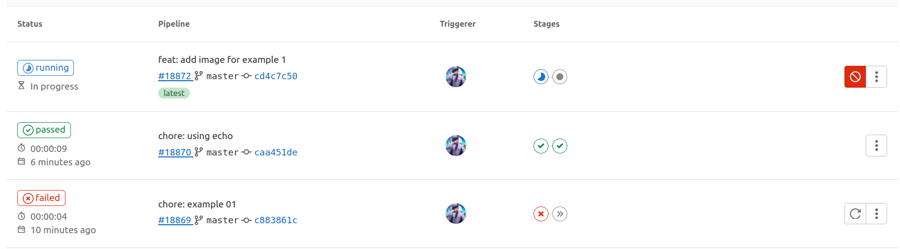
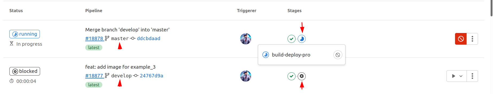
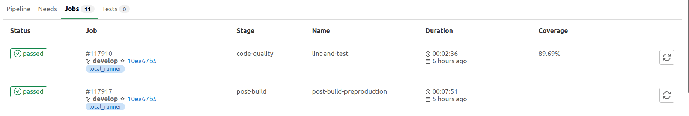

# Talking about Gitlab-CI config

## Configurar Gitlab-CI o 'las pipeline'

Previamente tener instalado Gitlab Runner

Luego creamos un un archivo `.gitlab-ci.yml`

En configuración podemos decirle donde estará nuestro archivo gitlab-ci

## Example 1

```yaml
# **** Etapas o Esenarios ****
stages:
  - test
  - build-deploy

# **** Trabajos ****
test:
  stage: test
  script:
    - nvm install 16.14.0
    - yarn install --cache-folder .yarn
    - yarn test

build-deploy:
  stage: build-deploy
  needs:
    - test
  script:
    - nvm install 16.14.0 --silent
    - yarn install --cache-folder .yarn
    - yarn build
    - ./my-deploy-script.sh
```



## Example 2

```yaml
# **** Etapas o Esenarios ****
stages:
  - test
  - build-deploy

# **** Trabajos ****
test:
  stage: test
  script:
    - nvm install 16.14.0
    - yarn install --cache-folder .yarn
    - yarn test

build-deploy-pre:
  stage: build-deploy
  needs:
    - test
  script:
    - nvm install 16.14.0 --silent
    - yarn install --cache-folder .yarn
    - yarn build
    - ./my-deploy-script-pre.sh
  only:
    - develop

build-deploy-pro:
  stage: build-deploy
  needs:
    - test
  script:
    - nvm install 16.14.0 --silent
    - yarn install --cache-folder .yarn
    - yarn build
    - ./my-deploy-script-pro.sh
  only:
    - master
```

## Example 3

Variables en gitlab-ci, en el proyecto, locales y globales.

Variable predefinidas [link doc](https://docs.gitlab.com/ee/ci/variables/predefined_variables.html)

- HOST_DOMAIN: Variable locales
- NODE_VERSION: Variable del proyecto
- CI_COMMIT_BRANCH: Variable global

```yaml
variables:
  HOST_DOMAIN: "git-adserver.addevweb.com"
  HOST_DOMAIN_PRE: "$HOST_DOMAIN/pre"
  HOST_DOMAIN_PRO: "$HOST_DOMAIN/pro"

# **** Etapas o Esenarios ****
stages:
  - test
  - build-deploy

# **** Trabajos ****
test:
  stage: test
  script:
    - nvm install "$NODE_VERSION"
    - yarn install --cache-folder .yarn
    - yarn test

build-deploy-pre:
  stage: build-deploy
  needs:
    - test
  script:
    - nvm install "$NODE_VERSION" --silent
    - yarn install --cache-folder .yarn
    - yarn build
    - ./my-deploy-script.sh "$HOST_DOMAIN_PRE"
  rules:
    - if: '$CI_COMMIT_BRANCH == "develop"'
      when: manual
    - when: never

build-deploy-pro:
  stage: build-deploy
  needs:
    - test
  script:
    - nvm install "$NODE_VERSION" --silent
    - yarn install --cache-folder .yarn
    - yarn build
    - ./my-deploy-script.sh "$HOST_DOMAIN_PRO"
  only:
    - master
```



```yaml
build-deploy-pre:
  stage: build-deploy
  rules:
    - if: '$CI_COMMIT_BRANCH == "develop"'
      when: manual
    - when: never

build-deploy-pre:
  stage: build-deploy
  only:
    - master
  when: manual
```

## Example 4

Extend y before script, ojo con rules y only

```yaml
.install-deps:
  before_script:
    - nvm install "$NODE_VERSION" --silent
    - yarn install --cache-folder .yarn
  needs:
    - test

.preproduction:
  variables:
    HOST_DOMAIN_PRE: "$HOST_DOMAIN/pre"
    ENV: "preproduction"

.production:
  variables:
    HOST_DOMAIN_PRO: "$HOST_DOMAIN/pro"
    ENV: "production"

# **** Etapas o Esenarios ****
stages:
  - test
  - build-deploy

# **** Trabajos ****
test:
  stage: test
  script:
    - yarn test

build-deploy-pre:
  stage: build-deploy
  extends:
    - .install-deps
    - .preproduction
  script:
    - yarn build
    - ./my-deploy-script.sh "$HOST_DOMAIN_PRE"
  rules:
    - if: '$CI_COMMIT_BRANCH == "develop"'
      when: manual
    - when: never

build-deploy-pro:
  stage: build-deploy
  extends:
    - .install-deps
    - .production
  script:
    - yarn build
    - ./my-deploy-script.sh "$HOST_DOMAIN_PRO"
  only:
    - master
```

## Example 5

Mostrar coverage en pipeline

```yaml
test:
  stage: test
  script:
    - yarn test
  except:
    - triggers
    - tags
    - merge_requests
  coverage: '/Lines\s*:\s*(\d+.?\d*)%/'
```



## Example 6

Cache

```yaml
stages:
  - install
  - build
  - deploy

install:
  stage: install
  script:
    - npm install
  cache:
    key:
      files:
        - package-lock.json
    paths:
      - node_modules

build:
  stage: build
  dependencies:
    - install
  script:
    - npm run build
  cache:
    key:
      files:
        - package-lock.json
    paths:
      - node_modules
    policy: pull

deploy:
  stage: deploy
  dependencies:
    - build
  script:
    - bash ./deploy.sh
```

```yaml
job:
  script:
    - echo 'yarn-offline-mirror ".yarn-cache/"' >> .yarnrc
    - echo 'yarn-offline-mirror-pruning true' >> .yarnrc
    - yarn install --frozen-lockfile --no-progress
  cache:
    key:
      files:
        - yarn.lock
    paths:
      - .yarn-cache/
```

```yaml
prepare-dependencies-job:
  stage: build
  cache:
    key: gems
    paths:
      - vendor/bundle
    policy: push
  script:
    - echo "This job only downloads dependencies and builds the cache."
    - echo "Downloading dependencies..."

faster-test-job:
  stage: test
  cache:
    key: gems
    paths:
      - vendor/bundle
    policy: pull
  script:
    - echo "This job script uses the cache, but does not update it."
    - echo "Running tests..."
```

## Example 7

Artifacts

```yaml
stages:
  - test

test:
  stage: test
  script:
    - npm install
    - npm run test --coverage
  artifacts:
    paths:
      - test_coverage.html
    expire_in: 1 hour
```

## Example 8

Cache y Artifacts

```yaml
stages:
  - install
  - build
  - deploy

variables:
  npm_config_cache: "$CI_PROJECT_DIR/.npm"

install:
  stage: install
  script:
    - npm install
  cache:
    key:
      files:
        - package-lock.json
    paths:
      - .npm
  artifacts:
    paths:
      - node_modules
    expire_in: 1 hour

build:
  stage: build
  dependencies:
    - install
  script:
    - npm run build

deploy:
  stage: deploy
  dependencies:
    - install
    - build
  script:
    - bash ./deploy.sh
```

## Example 9

```yaml
#
# https://gitlab.com/gitlab-org/gitlab/-/tree/master/lib/gitlab/ci/templates/Nodejs.gitlab-ci.yml
#
image: node:latest

# Cache modules in between jobs
cache:
  key: $CI_COMMIT_REF_SLUG
  paths:
    - .npm/

before_script:
  - npm ci --cache .npm --prefer-offline

test_async:
  script:
    - node ./specs/start.js ./specs/async.spec.js
```

